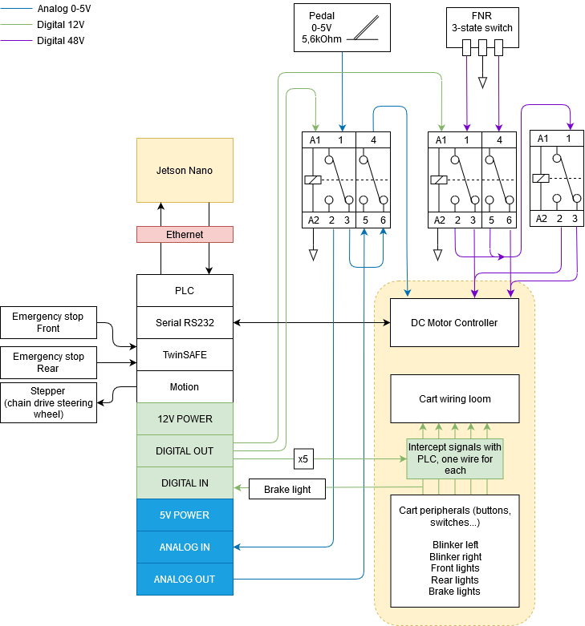

# Automotive-PLC

## General information
The goal of this project is to rebuild an old golf cart so it can drive people from the parking to their working space around our campus autonomously.

This repository contains the PLC part of the joint school project to build a golfcart. The other two parts can be found in the repositories below.
  - Automotive2 	: https://github.com/KingAbad/Autonomous_Cart_2
  - Automotive-AI 	: https://github.com/randomRexx/ADAS_AI_cart
 
 ## source roadmap
 ```
 Documentatie clubcart		directory with documentation of the cart
 Documentatie project		directory with documentation about the project
 PLCAutomotive			directory that contains the twincat program
 ```

### Motion
In order for the cart to drive on its own it needs to be able to steer. This is done by attaching a stepper motor to the steering mechanism. The schematics that show the construction can be found in the project directory. Ai team will send a steer and degree string that the twincat motion program will pick up and execute.
We also measure the amperage the motor takes to see if the driver onboard is steering, if this is the case the cart will stop driving autonomous and the driver can take over.

### Twinsafe
Before the cart can drive autonomous the reset needs to pushed, this needs to be done every startup or after a emergystop has been pressed. If you open the twincat program and look under safety you will find the code for the emergency buttons. The cart has two buttons that both contain 2 NC contacts. in the code you can see that there are 2 groups of 2 contacts. The twinsafe input terminal has 4 inputs which all have a plus and minus plug. The input terminal will take turn in sending a small puls to every plus plug to check if the emergency stop has been pressed. If a contact doesn't return the puls the safety plc will stop the cart. This way you can also see the diffrence between a buttoin press or if a cable is broken as only one of the 2 contacts of a button will not return the puls.

### TwinCAT_TCP_IP_Server

A function block for receiving and sending data using TF6310 TwinCAT TCP/IP Server.

- Usage

		-Video guide: https://www.youtube.com/watch?v=ATKTYQo91UY
		-Install TwinCAT
		-Install Python3.
		-Run the TwinCAT program in PLCAutomotive.
		-If using anything else than localhost on Microsoft Windows,
			add TCP port 24100 as exclusion in firewall (inbound and outbound)
			https://answers.microsoft.com/en-us/windows/forum/all/adding-windows-firewall-exceptions/6e4578ae-420d-46a6-8bbc-3182b31e6ebd
		
		-Run tcp_client.py using python3

See [Commands.md](Commands.md) for the available commands. TwinCAT will echo back all commands.

- How it works
What's happening inside the function block FB_TcpServer:

The function block FB_SocketConnect will open the socket at the specific port (in our example port:24100).
Python client will then need to connect to the host and the port.
Every half a second, FB_SocketAccept will accept any incoming connection, and populate the variable 'hSocket' with the local address of the server and remote address of the client.
The server program also expects a command from the client every 200ms, if no command is received in 200ms it is considered as disconnected.

The function block FB_SocketSend and FB_SocketReceive use this 'hSocket' variable to send and receive data.



## Built with
* *Twincat 3*
* *Python 3*

## Authors

* *Dieter Vanrykel* - lector
* *Max Valkenburg* - student
* *Sam Knoors* - student
* *Oguzhan Erdem* - Student
* *Berkan Ipek* - Student


